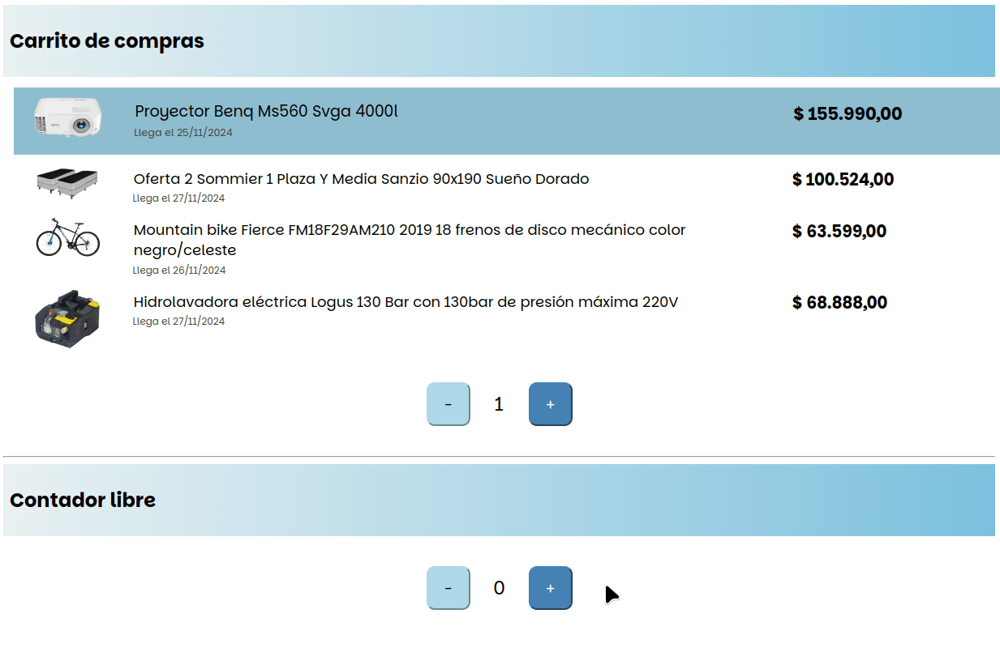

# Carrito de compras en Svelte

[](https://github.com/uqbar-project/eg-carrito-compras-svelte/actions/workflows/build.yml) [](https://codecov.io/gh/uqbar-project/eg-carrito-compras-svelte)



## Componente contador

En este ejemplo tenemos un componente contador, con algunas cosas interesantes para contar

- por un lado, recibe como parámetro el valor inicial, el rango desde y hasta. Utilizamos para ello la runa `$props`
- el rango desde y hasta son opcionales, por eso proveemos un valor por defecto
- pero además, **nosotros queremos que el Contador avise al componente llamador cuando cambie el valor**. Y ésto lo logramos con la runa `$bindable`

Veamos la implementación

```sv
  let { valor = $bindable(0), desde, hasta }: ContadorProps = $props()
```

Luego es un componente común de Svelte, al presionar los botones `+` y `-` vamos sumando o restando el valor

> Eh, respeten los rangos...

claro, y en el caso de tener rangos vamos a movernos sin pasarnos del límite. Por ejemplo, si queremos ir de 1 a 3 al presionar el botón sumar 4 veces el valor irá cambiando de 1 inicialmente a: 2, 3, nuevamente a 1 y 2 finalmente. Lo mismo ocurre al hacer click sobre el botón restar.

Pueden ver la implementación en el archivo [Contador](./src/lib/Contador.svelte), que está en la carpeta `lib`, donde van elementos generales que pueden ser usados desde cualquier ruta.

## Componente para la fila de producto

La fila de un producto también recibe props, en este caso

- la información del producto, que es un objeto
- pero también una `key`, que nos va a servir principalmente para el testeo de frontend
- y por último un booleano que nos indica si la fila está seleccionada (para visualizarlo con un color diferente)

Otra cosa interesante es que tenemos que formatear el precio del producto utilizando el locale es-AR (separadores de miles con punto y coma decimal), y formatear la fecha a día/mes/año con 4 dígitos.

Pueden ver la implementación en el archivo [ProductoRow](./src/lib/ProductoRow.svelte), que también está en la carpeta `lib`.

## Componente principal

En este elemento vamos a unir lo que vimos antes:

- por un lado tenemos un componente Contador aislado, que sube o baja indefinidamente
- pero también hay un componente Contador que va de 1 a la cantidad de productos, y que bindea el valor de ese contador con el estado del componente padre. Mediante una iteración (`#each`) construye la lista de productos pasando el elemento seleccionado como el enésimo de la lista. **Cuando nos movemos en el contador, eso produce un cambio visual de cuál es el producto de la lista que está seleccionado**.

```sv
<script>
  ...
  let itemSeleccionado = $state(1)
</script>

...

{#each productos as producto, i}
  <ProductoRow producto={producto} seleccionado={i + 1 === itemSeleccionado} key={i + 1}/>
{/each}

<Contador bind:valor={itemSeleccionado} desde={1} hasta={productos.length}></Contador>
```

Fíjense que estamos trabajando el `bind` de valor del primer contador, para recibir notificaciones ante el cambio desde el componente hijo. En cambio, en el segundo contador no hacemos un bind, porque no nos interesa escuchar esos cambios:

```sv
<Contador/>
```

## Testeo de los componentes

La parte más interesante es cómo testeamos el componente padre (el lector puede ver los tests específicos de cada componente). Aquí como tenemos dos contadores, hacemos una búsqueda de todos los botones sumar y restar y elegimos el primero de ellos porque sabemos que el primer contador es el que está ligado a la lista de productos. Por supuesto si la disposición de los contadores cambia, eso va a romper los tests de frontend. Para poder diferenciar cada fila de los productos, estamos pasando como prop una key, que es lo que usamos como data-testid del div que contiene la información de un producto. En una tabla de productos, la primera fila tendrá un data-testid `row-1`, la segunda `row-2`, etc. etc.

```ts
  it('si se presiona el botón +, avanza al segundo elemento como elegido', async () => {
    render(Carrito)
    const sumarList = await screen.findAllByTestId('sumar')
    expect(sumarList.length).toBeGreaterThan(0)
    await sumarList[0].click()
    expect(screen.getByTestId('row-2').classList).toContain('elegido')
  })
```
